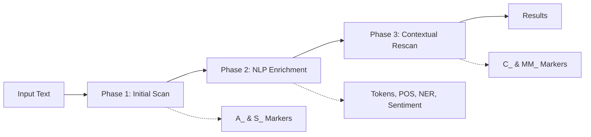

# MarkerEngine v1.0 - Spark NLP Integration

## 🚀 Overview

MarkerEngine now features a sophisticated Spark NLP integration that enables advanced semantic reasoning through a 3-phase analysis pipeline. This implementation provides deep linguistic analysis while maintaining backward compatibility and graceful degradation.

## 🏗️ Architecture

### 3-Phase Analysis Pipeline



1. **Phase 1: Initial Scan**
   - Fast pattern matching for atomic (A_) and signal (S_) markers
   - No NLP overhead
   - Builds activation candidates

2. **Phase 2: NLP Enrichment**
   - Tokenization and sentence segmentation
   - Part-of-speech tagging
   - Named entity recognition
   - Dependency parsing
   - Sentiment analysis
   - German language optimized

3. **Phase 3: Contextual Rescan**
   - Activates composed (C_) and meta-markers (MM_)
   - Uses NLP data for sophisticated reasoning
   - Complex activation rules
   - Confidence score adjustments

### Key Components

#### 1. AnalysisContext
Central data structure that flows through all phases:

```python
class AnalysisContext:
    request_id: str
    text: str
    tokens: List[str]
    sentences: List[str]
    pos_tags: List[Dict[str, str]]
    named_entities: List[Dict[str, Any]]
    dependency_parse: List[Dict[str, Any]]
    sentiment_scores: Dict[str, float]
    detected_markers: List[Dict[str, Any]]
    metadata: Dict[str, Any]
```

#### 2. SparkNlpService
Full implementation with German language support:

- **Models**: German-specific NLP models
- **Pipeline**: Optimized Spark ML pipeline
- **Fallback**: Graceful degradation if Spark unavailable
- **Caching**: Model caching for performance

#### 3. ActivationRulesEngine
Advanced rule types for marker activation:

- **ALL**: All components required
- **ANY**: At least one component
- **ANY_N**: At least N components
- **TEMPORAL**: Sequential patterns with time windows
- **SENTIMENT**: Sentiment-based activation
- **PROXIMITY**: Distance-based rules
- **NEGATION**: Negation context detection
- **PATTERN**: Linguistic pattern matching
- **COMPOSITE**: Combined rules with AND/OR logic

#### 4. OrchestrationService
Coordinates the entire pipeline:

- Phase management
- Error handling
- Performance tracking
- Result aggregation

## 🛠️ Installation

### Option 1: Without Spark NLP (Lightweight)

```bash
pip install -r requirements-base.txt
export SPARK_NLP_ENABLED=false
uvicorn app.main:app --reload
```

### Option 2: With Spark NLP (Full Features)

```bash
# Install Java (required for Spark)
# macOS:
brew install openjdk@11

# Ubuntu:
sudo apt-get install openjdk-11-jre-headless

# Install dependencies
pip install -r requirements-spark.txt

# Configure environment
export SPARK_NLP_ENABLED=true
export JAVA_HOME=$(/usr/libexec/java_home -v 11)  # macOS
# export JAVA_HOME=/usr/lib/jvm/java-11-openjdk-amd64  # Linux

# Run application
uvicorn app.main:app --reload
```

## 🐳 Docker Deployment

### Build and Run

```bash
# Base version (no Spark)
docker-compose up markerengine-base

# Spark version (full NLP)
docker-compose up markerengine-spark

# Both versions
docker-compose up
```

### Multi-stage Dockerfile

- **Base stage**: Core functionality, ~200MB
- **Spark stage**: Full NLP support, ~2GB

## 📡 API Usage

### Enhanced Analysis Endpoint (v2)

```bash
POST /analyze/v2
```

Request:
```json
{
  "text": "Ich liebe dich, aber ich brauche Zeit für mich.",
  "schema_id": "relationship_markers",
  "enable_nlp": true,
  "enable_contextual": true
}
```

Response:
```json
{
  "request_id": "550e8400-e29b-41d4-a716-446655440000",
  "status": "success",
  "markers": [
    {
      "marker_id": "S_LOVE",
      "confidence": 0.9,
      "detection_phase": "initial"
    },
    {
      "marker_id": "S_NEED_SPACE",
      "confidence": 0.85,
      "detection_phase": "initial"
    },
    {
      "marker_id": "C_AMBIVALENCE",
      "confidence": 0.92,
      "detection_phase": "contextual",
      "components": ["S_LOVE", "S_NEED_SPACE"],
      "nlp_enhanced": true
    }
  ],
  "phases": {
    "phase1_initial_scan": {
      "markers_found": 2,
      "processing_time": 0.12
    },
    "phase2_nlp_enrichment": {
      "enrichment": {
        "tokens": 11,
        "sentences": 1,
        "nlp_service": "spark_nlp"
      },
      "processing_time": 0.45
    },
    "phase3_contextual_rescan": {
      "markers_added": 1,
      "processing_time": 0.08
    }
  },
  "nlp_enriched": true,
  "total_processing_time": 0.65
}
```

### Service Status

```bash
GET /analyze/v2/status
```

### Batch Processing

```bash
POST /analyze/v2/batch
{
  "texts": ["Text 1", "Text 2", "Text 3"],
  "schema_id": "emotion_markers"
}
```

## 🧠 Activation Rules Examples

### Temporal Sequence

```json
{
  "activation": {
    "type": "TEMPORAL",
    "window": 10,
    "strict_order": true
  }
}
```

### Sentiment Contrast

```json
{
  "activation": {
    "type": "SENTIMENT",
    "alignment": "contrasting",
    "min_confidence": 0.6
  }
}
```

### Proximity-based

```json
{
  "activation": {
    "type": "PROXIMITY",
    "max_distance": 5
  }
}
```

### Composite Rule

```json
{
  "activation": {
    "type": "COMPOSITE",
    "operator": "AND",
    "rules": [
      {"type": "TEMPORAL", "window": 15},
      {"type": "SENTIMENT", "alignment": "contrasting"},
      {"type": "NEGATION", "allow_negation": false}
    ]
  }
}
```

## 📊 Performance Characteristics

### Without NLP
- Startup: ~2s
- First request: ~100ms
- Subsequent: ~50-100ms
- Memory: ~200MB

### With NLP
- Startup: ~10s
- First request: ~30-60s (model loading)
- Subsequent: ~200-500ms
- Memory: ~2-4GB

### Optimization Tips

1. **Pre-load Models**: Add to Dockerfile for faster cold starts
2. **Increase Memory**: Set `SPARK_DRIVER_MEMORY=6g` for large texts
3. **Enable Caching**: Use Redis for marker results
4. **Batch Processing**: Process multiple texts together

## 🧪 Testing

### Run Tests

```bash
# Unit tests
pytest tests/test_nlp_service.py -v
pytest tests/test_orchestration_service.py -v
pytest tests/test_activation_rules_engine.py -v

# Integration tests
pytest tests/test_spark_nlp_integration.py -v

# Full test suite
pytest tests/ -v --cov=app
```

### Test Coverage Areas

- NLP service initialization
- Text enrichment pipeline
- Activation rule engine
- Orchestration flow
- Error handling
- Performance benchmarks

## 🔧 Configuration

### Environment Variables

```bash
# Core settings
DATABASE_URL=mongodb+srv://...
MONGO_DB_NAME=marker_engine

# NLP settings
SPARK_NLP_ENABLED=true
SPARK_DRIVER_MEMORY=4g
SPARK_EXECUTOR_MEMORY=2g

# API settings
API_HOST=0.0.0.0
API_PORT=8000
```

### Spark Optimization

```python
# In spark_nlp_service.py
self._spark = SparkSession.builder \
    .appName("MarkerEngine_NLP") \
    .master("local[*]") \
    .config("spark.driver.memory", "4g") \
    .config("spark.sql.adaptive.enabled", "true") \
    .getOrCreate()
```

## 🚨 Troubleshooting

### Common Issues

1. **Java Not Found**
   ```bash
   export JAVA_HOME=/path/to/java
   java -version  # Should show Java 8 or 11
   ```

2. **Out of Memory**
   ```bash
   export SPARK_DRIVER_MEMORY=6g
   export JAVA_OPTS="-Xmx6g"
   ```

3. **Models Not Loading**
   ```python
   # Download manually
   python -c "import sparknlp; sparknlp.download('pos_ud_hdt', 'de')"
   ```

4. **Slow Performance**
   - First request loads models (expected)
   - Check memory allocation
   - Consider model caching

## 📈 Monitoring

### Metrics Exposed

- Request count and latency
- NLP processing time per phase
- Marker detection rates
- Memory usage
- Model loading time

### Prometheus + Grafana

```bash
# Enable monitoring
docker-compose --profile monitoring up

# Access dashboards
# Prometheus: http://localhost:9090
# Grafana: http://localhost:3000
```

## 🔒 Security

- API authentication ready
- Input validation
- Secure model loading
- Container security
- TLS for production

## 🚀 Future Enhancements

1. **GPU Acceleration**
   - CUDA-enabled models
   - Faster inference
   - Larger batch sizes

2. **Multi-language Support**
   - English models
   - Language detection
   - Cross-lingual markers

3. **Real-time Processing**
   - WebSocket support
   - Streaming analysis
   - Live updates

4. **Advanced Features**
   - Custom model training
   - Active learning
   - Explanation generation

## 📚 Resources

- [Spark NLP Documentation](https://nlp.johnsnowlabs.com/)
- [German Models](https://nlp.johnsnowlabs.com/models?lang=de)
- [Performance Tuning](https://nlp.johnsnowlabs.com/docs/en/install#performance-tuning)
- [API Documentation](http://localhost:8000/docs)

## 🤝 Contributing

1. Fork the repository
2. Create feature branch
3. Add tests
4. Submit pull request

## 📄 License

[Your License Here]

---

**Built with ❤️ using FastAPI, Spark NLP, and advanced NLP techniques**